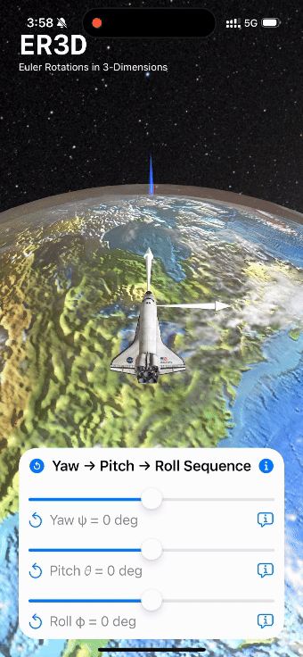

# ER3D

## Euler Rotations in 3-Dimensions

(Also known as Eliott Radcliffe in 3D)

Three-dimensional (3D) rotational kinematics are one of the most important, and yet also one of the most easily misunderstood topics of advanced mechanical engineering dynamics and trajectory simulation modeling. 
The ER3D mobile app aims to be a teaching aid for students and interested learners who want to understand these fundamental kinematics in an interactive and visually appealing setting, including in Augmented Reality.

Features of the app include:
- Space Shuttle model for teaching a 3-2-1 rotation sequencee
- Gyroscope model for teaching a 3-1-3 rotation sequence
- Sliders to update 3-2-1 (yaw, pitch, and roll) or 3-1-3 (procession, nutation, and spin) angles
- Globe Earth that may be rotated to visualize locations at different latitudes and longitudes
- Context menus with text descriptions of the kinematic properties

| Yaw                      | Pitch                        | Roll                       | Yaw → Pitch → Roll                               |
|--------------------------|------------------------------|----------------------------|--------------------------------------------------|
|  |  |  |  |

ER3D is free and open source, developed for iPhone, iPad, macOS, and VisionOS using SwiftUI and RealityKit.

- The app target for the primary development version may be found [here](https://github.com/radcli14/er3d/tree/main/ER3D/EulerRotations3D).
- A Reality Composer Pro project containing 3D assets is [here](https://github.com/radcli14/er3d/tree/main/ER3D/Globe).

## Older Version

The initial development of ER3D was made using SceneKit.
That is considered legacy code, but the screenshots below are from that version, and its app target is [here](https://github.com/radcli14/er3d/tree/main/ER3D/ER3D).

| Yaw                    | Pitch                      | Roll                     | Yaw → Pitch → Roll                             |
|------------------------|----------------------------|--------------------------|------------------------------------------------|
|  |  |  |  |
